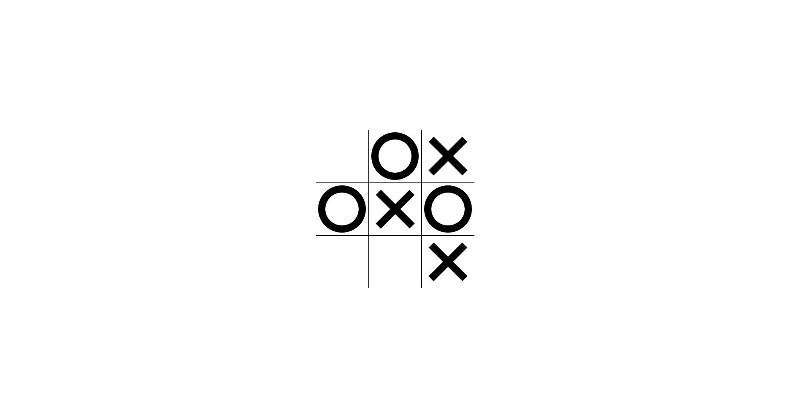

<h1 align="center">
  :floppy_disk: Tic-Tac-Toe :floppy_disk:
</h1>


<p align="center">
  
</p>


## :bookmark: Sobre
Um simples jogo da velha com a tecnologia JavaScript.

<a id="documentacao"></a>

## :rocket: Tecnologias Utilizadas

O projeto foi desenvolvido utilizando as seguintes tecnologias

- [Javascript](https://www.typescriptlang.org/)

## :heavy_check_mark: Inteface:

<h1 align="center">
    
</h1>

<a id="como-usar"></a>

## :fire: Como usar

1. Faça um clone :

```sh
  $ git clone https://github.com/CharlesLB/javascript-minigames.git
```

2. Para executar:

```sh
  # Basta abrir a página .html
```

<a id="como-contribuir"></a>

## :recycle: Como contribuir

- Faça um Fork desse repositório,
- Crie uma branch com a sua feature: `git checkout -b my-feature`
- Commit suas mudanças: `git commit -m 'feat: My new feature'`
- Push a sua branch: `git push origin my-feature`

## :memo: License

Esse projeto está sob a licença MIT. Veja o arquivo [LICENSE](LICENSE.md) para mais detalhes.
